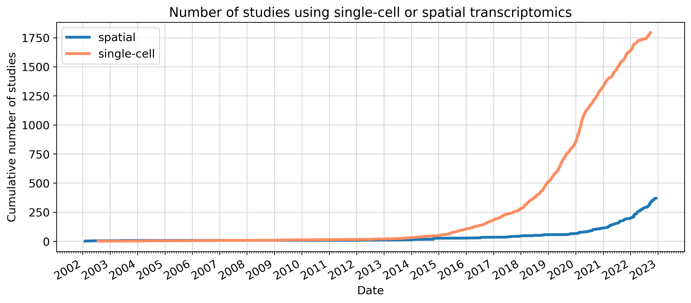

# single-cell-studies-over-time

This repository generates plots showing the increase in single-cell RNA-sequencing studies over time. The plots are automatically updated every week.

Data source (please cite):  
Valentine Svensson, Eduardo da Veiga Beltrame, & Lior Pachter  
Database, Volume 2020, 2020, baaa073; doi: 10.1093/database/baaa073  
https://doi.org/10.1093/database/baaa073

Also see:  
https://www.nxn.se/single-cell-studies. 
https://www.nxn.se/single-cell-studies/gui

Code partly adapted from:
https://colab.research.google.com/github/pachterlab/kallistobustools/blob/master/docs/tutorials/scRNA-seq_intro/python/scRNA-seq_intro.ipynb

